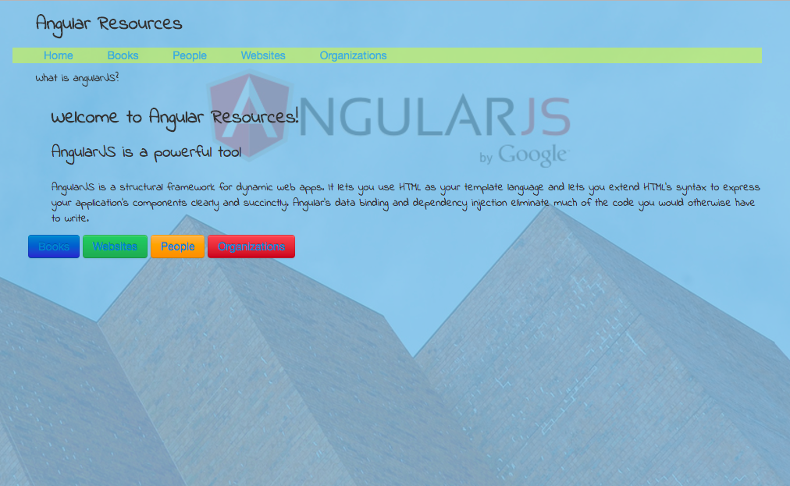

# Angular Resources

This is an app that serves a dual purpose of sharing informational resources to the user, as well as practice using the different technologies.

## 7/9/2015
## Written By: [David Eliason](http://www.davethemaker.com)

### An app built on AngularJS that shares AngularJS resources and tips
### Objective: to use directives, partials, views, controllers, factories

[Return to Portfolio](https://davideliason.github.io/)

### Directions: 

First, clone the repository:
```
$ git clone https://github.com/davethemaker/angularResources.git 
```
Then, navigate to within that project folder:
```
$ cd angularResources
```
Next, start up a web server. One easy way to do that is by using the following command: python -m SimpleHTTPServer
```
$ python -m SimpleHTTPServer
```
Lastly, once the server has started, open up a browser window with the URL address of localhost:8000



[Return to Portfolio](https://davideliason.github.io/)

MIT License

